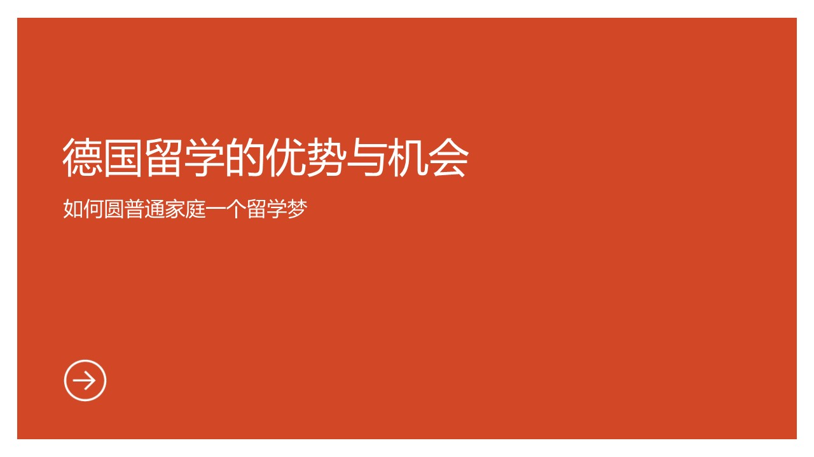
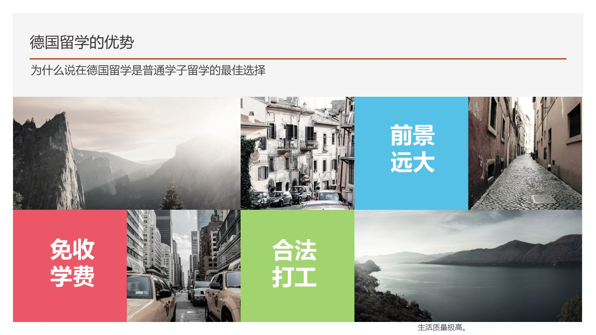
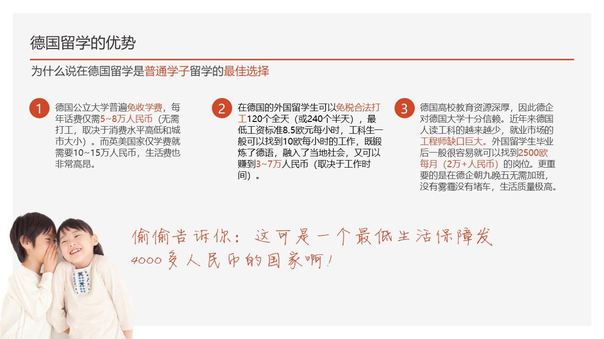
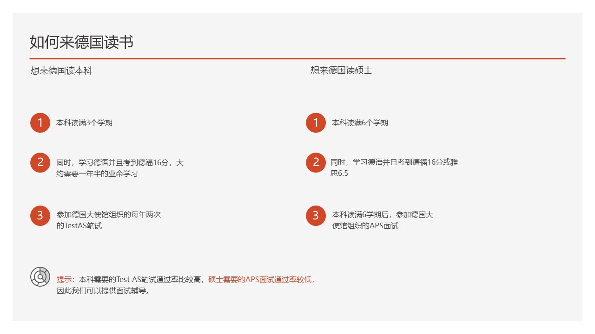

# 德国留学的优势与机会

1. 德国**不收学费**，就免了美帝那种一门课几百上千美元的学费；同时可以合法打工，**去Bosch、奔驰、保时捷做专业相关的学生工或者实习**，而不是像美帝那样给人洗盘子。这样对于穷人来说就很合适。
2. 第二是德国大公司招人**更倾向于外国女性**。跟中国不愿意招即将结婚的女性不同，德国的大公司更愿意收外国女性。因为一般学工科的女性少，而德国法律又规定了女员工不能少于一个比例，所以女生反而更受欢迎。跨国公司为了自己的国际化，会更喜欢外国人。
3. 第三，在德国工作的话，**不加班**。如果每周工作超过40小时，就开始算加班，给加班费。另外如果经常性加班，工会会找HR，HR会找你的上司谈话，会影响他的奖金和晋升……所以德国公司都是求着你不要加班。其实这个不加班真的挺好的，**大家普遍都是7点上班，3点下班，去2小时健身房，5点去接孩子下学。**当全社会都对劳动法严格遵守的时候，就没有公司可以通过加班来获得竞争优势，就不会想着让员工加班了。

那么如何来德国读书呢。。。  
两种套路，一个是本科来，一个是硕士来  
* 学历要求：本科来的话，正常高考，**211大学，读满1学期**，**非211大学读满3学期**，即可参加TestAS笔试，通过即可；硕士的话，**本科读满6学期**即可参加APS审核，通过即可  
* 语言要求：本科基本都是德语教学，所以需要学德语，**考到德福16分**（难度相当于雅思7吧）；硕士有德语专业和英语专业，前者要求**德福16分**，后者要求**雅思6.5**  
最最重要的是，**全程不能换专业**，所以高考报志愿一定要选择一个喜欢且有前景的专业。

